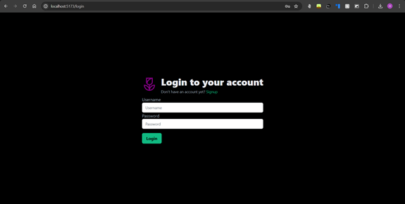
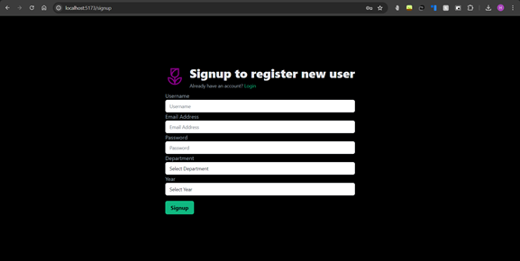
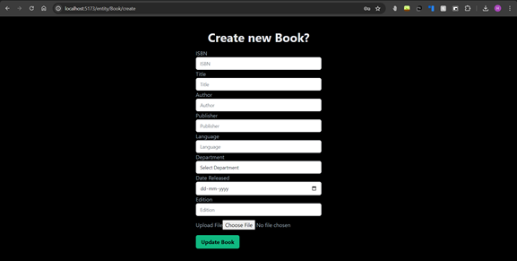
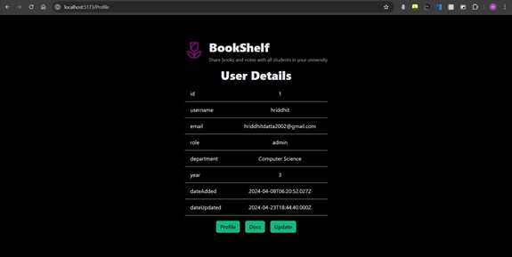
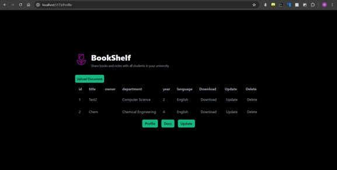
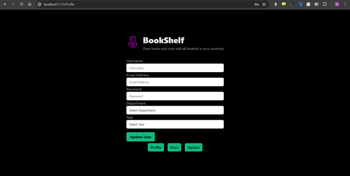

<H1>Bookshelf</H1>

Introducing our university web application: a dynamic platform designed to streamline textbook sharing, foster collaborative note-taking, and enhance the academic experience for students and educators alike.

 

Bookshelf is a web app that a university can use to host textbooks on their server and allow students to access them at any point of time. Students can then signup for the site and get access to notes and documents that other students have shared and can share their own documents.

[Bookshelf-backend](https://github.com/AryanTijare/Bookshelf-backend)

Libraries used: Frontend

<ul>ReactJs</ul>
<ul>TailwindCSS</ul>
<ul>Axios</ul>
 

Backend

<ul>ExpressJS</ul>
<ul>TypeORM(with MySQL as the database)</ul>
<ul>MulterJS</ul>
<ul>JWT</ul>
